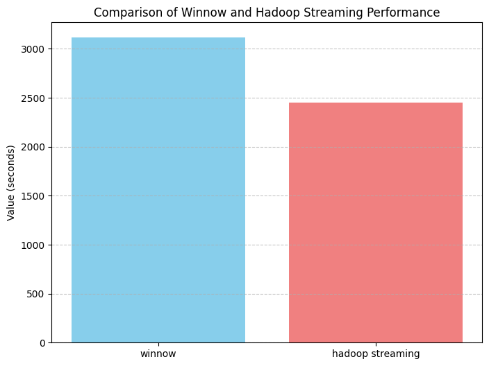

# Hadoop Streaming vs Winnow Benchmarks

The benchmarks are run on AWS and provisioned with terraform. Both tests are run with the following
specs:
- 172 map jobs
- 20 reduce jobs
- 6 x t3.large + 45GiB root block storage per instance

**Why word frequency?** While the mapper is light, it produces large intermediate files, which are then
processed by heavier reducers. This allows a comparison of jobs that iterate over all the input in both the map and reduce stages.

**The data used in this benchmark.** The input data is ~100,000 text files downloaded from Project Gutenberg's
mirror, totaling 23.6 Gb. This data has been merged into a singular file, so
that MapReduce doesn't thrash jobs. Without this pre-run optimization just the
map stage alone would have taken approximately ~126 hours to complete.

**Future benchmarks for these systems.** Due to a limited amount of resources, I
was only able to test the "straight-shot" workload of Winnow and Hadoop
Streaming. In the future, benchmarks regarding failure recovery would shed light
on how each failure model compares.

## Cluster configurations

### Hadoop Streaming

**Version 3.5.0**
- 1 namenode
- 5 datanodes

### Winnow

**Version 1.0.0**
- 6 instances connected in one cluster

## Results

|Script|Winnow run time|Hadoop Streaming run time|
|---|---|---|
|load_data.sh|0s|221s|
|run_test.sh| 3114s = 51m54s| 2452s = 40m52s|

## Discussion

Introducing WASM-based UDFs (user-defined functions) to projects in the data processing world is not unique. A prototype was created for Apache Spark, with the [resulting report](https://github.com/rhuffy/spark-wasm-udf/blob/main/report.pdf) showing that WASM UDFs were ~7x slower than native code. This begs the question of why Winnow is only ~1.25x slower than Hadoop Streaming. Winnow's non-forking processing structure and binary encoding are strong contenders for its comparable performance—although more profiling and performance testing is needed to exactly pinpoint the reasons.

**Non-forking processing structure**

When a Winnow instance receives a map task from the leader, it does not need to create a new process when calling the UDF. Winnow instantiates or reuses a loaded WASM binary to compute the input directly. Hadoop Streaming instead creates a new process and passes the key-value pairs through stdin/out. The choice to use pure functions in conjunction with lightweight, user-space tokio threads for request handling cuts the overhead of creating a new process.

**Binary encoding**

Hadoop Streaming passes messages to the running UDFs through stdin/stdout. Winnow uses [msgpack](https://msgpack.org/index.html) to encode input and output data, allowing liter requests and memory footprint than plain textual data with delimiters. This added footprint may cause higher request latency and decoding/encoding processing time over Winnow's binary representation.
